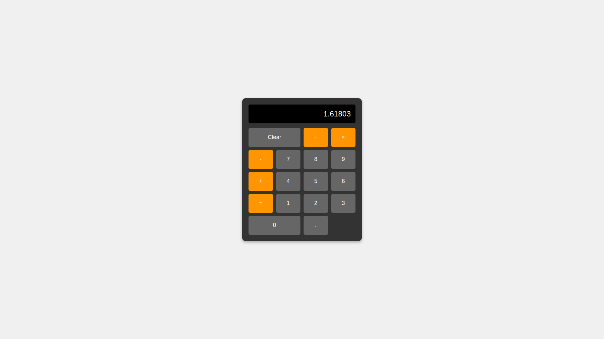

# JavaScript Calculator

A simple web-based calculator built with HTML, CSS, and JavaScript. Supports basic math operations without using eval().



## Features

- Basic arithmetic operations (+, -, ×, ÷)
- Clear function
- Decimal point support
- Continuous calculations
- Zero division error handling
- Responsive design

## Technologies Used

- HTML5
- CSS3
- JavaScript (Vanilla)

## How to Use

1. Clone the repository:

```bash
git clone https://github.com/transcenddev/js-calculator.git
```

2. Open `index.html` in your web browser

Or use VS Code with Live Server:

1. Install Live Server extension
2. Right-click `index.html`
3. Select "Open with Live Server"

## Project Structure

```
js-calculator/
│
├── index.html      # Calculator interface
├── styles/
│   └── style.css   # Calculator styling
└── scripts/
    └── script.js   # Calculator logic
```

## License

MIT License

## Author

2049rae
